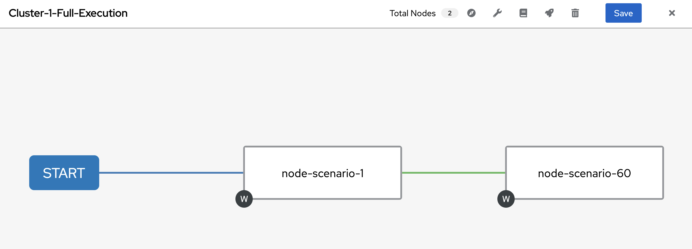
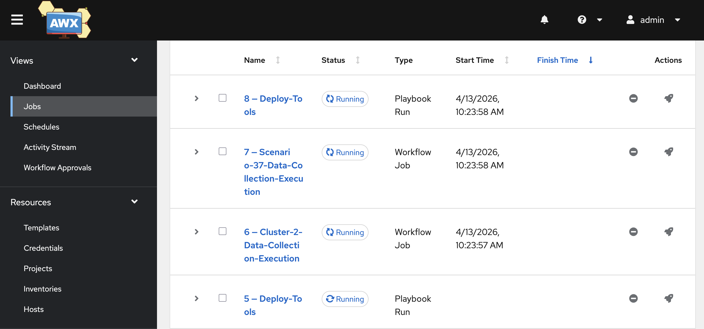
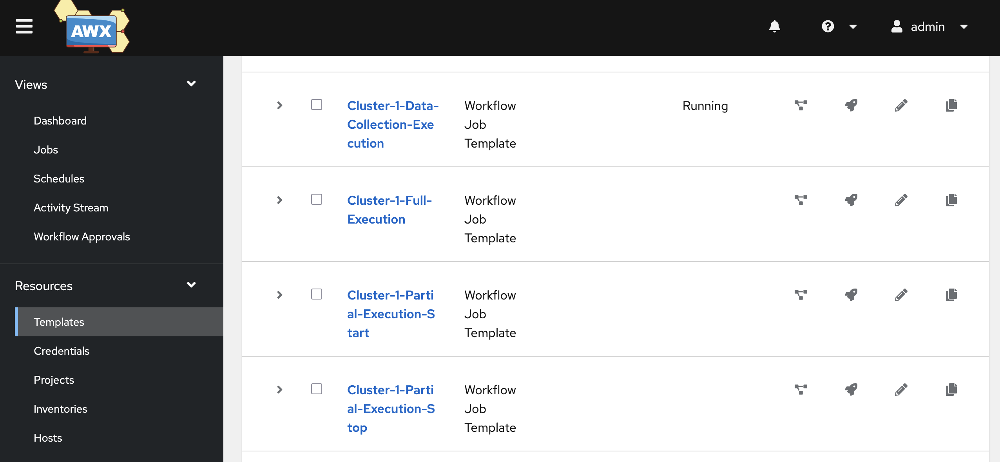
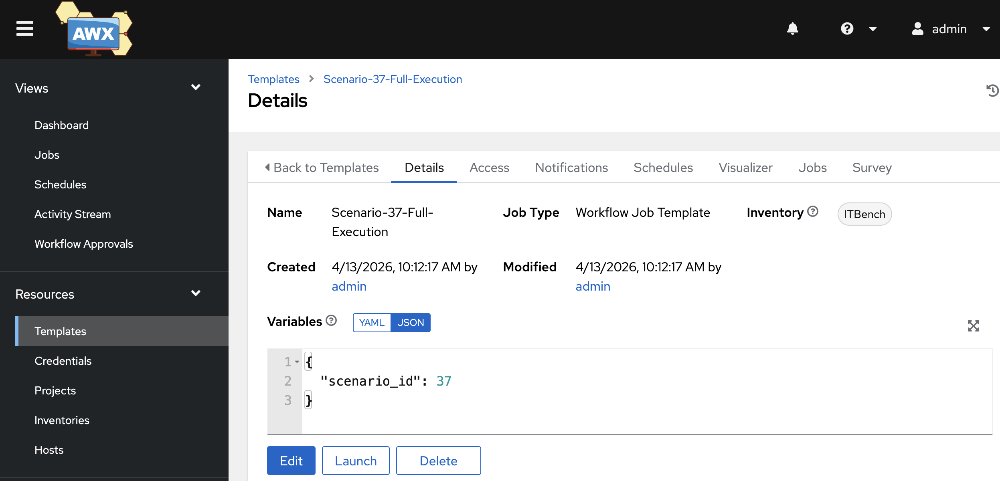

# ITBench on AWX

## Overview

ITBench uses [AWX](https://docs.ansible.com/projects/awx/en/latest/) for managing multi-trial benchmark executions across multiple clusters. This is primarily used for SRE and FinOps scenarios, where the results of the agent's diagnosis and remidation attempts are nondeterministic.

## Requirements

While the recommended AWX image is built and supplied by ITBench, the ITBench required software and dependencies will still need to be installed in order to run the commands needed to run AWX on a cluster.

For the clusters running the experiements (also known referred to as `runners`), please ensure that each node has **at least**: 8 CPUs, 16 GB of memory, 50 GB of disk storage. These are the minimum requirements of running ITBench on a single cluster.

If running both AWX and a `runner` on the same cluster (ie: Kind, Minikube, etc), please ensure that the machine has **at least**: 24 CPUs, 32 GB of memory, 100 GB of disk storage.

>[!NOTE]
>When creating an AWX stack with a `Kind` cluster with [our provided setup](../../clusters/kind/README.md), this hardware check is done as a part of the creation process. It will produce a warning message in the console when the machine lacks the necessary requirements. **When running on an underprovisoned cluster, poor performance is expected.**

>[!NOTE]
>When creating an AWX stack with AWS and `kOps` [our provided setup](../../clusters/kops/README.md), this hardware check is done as a part of the creation process. It will produce a warning message in the console when the machine lacks the necessary requirements. **When running on an underprovisoned cluster, poor performance is expected.**

## Set Up

ITBench defines an AWX setup as a stack. This AWX stack has two components: one cluster which acts as the `head` and one or more cluster(s) which act as `runners`. When using a local machine, the `head` and the `runner` can be the same, but - as noted in the [requirements](#requirements) section - requires more resources. The `head` cluster is where AWX will be installed. The `runners` will be used by the `head` cluster to run the scenarios.

### AWX with SRE and FinOps Scenarios

The playbooks feature a number of [group variables](../../scenarios/sre/inventory/group_vars/). Each one will be described here:

| File Name | Function |
| --- | --- |
| [agent.yaml](../../scenarios/sre/inventory/group_vars/runner/agent.yaml.example) | Configures the agent configuration and version |
| [experiments.yaml](../../scenarios/sre/inventory/group_vars/runner/experiments.yaml.example) | Configures scenarios and number of trials to run |
| [github.yaml](../../scenarios/sre/inventory/group_vars/runner/github.yaml.example) | Configures the ITBench and Agent repositories |
| [stack.yaml](../../scenarios/sre/inventory/group_vars/runner/stack.yaml.example) | Configures the head and runner clusters |
| [storage.yaml](../../scenarios/sre/inventory/group_vars/all/storage.yaml.example) | Configures the storage options for data files |

> [!NOTE]
> Some of the yaml files have sections commented out. This is to show parameters which are optional. If they are not needed, leave them commented out. Otherwise, uncomment them and fill them out as needed.

After creating an AWX stack, go to the `scenarios/sre` directory.

#### Creation

1. Create and configure the group variables.
```shell
make group-vars
```

>[!NOTE]
>If using [our kops setup](../../clusters/kops/README.md), use `make sync-stack-group-vars` to export the kubeconfig files and configure the [`stack.yaml`](../../scenarios/sre/inventory/group_vars/runner/stack.yaml) group variables. If using [our kind setup](../../clusters/kind/README.md), the default group variables made at creation will suffice.

>[!WARNING]
>If the group variables were already created as a part of development or running the SRE and FinOps scenarios beforehand, skip this step. Running the command will override the existing files.

2. Install AWX on the `head` cluster.
```shell
make deploy-awx
```

>[!WARNING]
>Ensure that the head cluster has access to some kind of service provider. Without it, the installation process will fail. If using one of [our cluster setups](../../clusters/), then this should be taken care of.

Installation takes around 10 minutes. **Upon successful completion**, there will be a final message which will detail the **url**, **username**, and **password** to use for accessing the instance. This url can be entered into a browser to get to the web interface, where the progress of the workflows are visualized. For more information about the interface and AWX itself, please consult [its documentation](https://github.com/ansible/awx/blob/devel/docs/overview.md).

3. Configure the AWX resources
```shell
make configure-awx-stack
```

#### Scenario Execution

In the [creation phase](#creation), various resources were created for the `head` cluster to use. For running a scenario, the particularly important resource is the **cluster based workflows**. The process of running a scenario is its own dedicated workflow. However, excuting that workflow on a `runner` is done those the cluster based version. This type of workflow runs a set of scenarios sequentially on the same cluster, provided that the scenario completes successfully.

Due to this setup, multiple scenarios (and trials) can be run on the same `runner(s)`. However, this is often **not** time efficient. This means that one needs to determine for themselves what is the right balance of monetary cost and time for running multi-trial scenarios on the AWX stack.



1. Run the workflow
```shell
make launch-full-workflow
```



>[!NOTE]
>While there are several `launch` workflow make commands, the one listed above is the one of most interest to the general popoulation (`full`).
>
>The `data-collection` workflow is primarily used to collect data from a scenario for our offline offering, [ITBench-Lite](https://huggingface.co/spaces/ibm-research/ITBench-Lite). The `start` and `stop` workflows are launched by our system for runs against the leaderboard. All three of the workflows mentioned **do not** run the agent as a part of the workflow. Generally speaking, these workflows should not be used for general or development use.

#### Deletion

1. Uninstall AWX on the `head` cluster.
```shell
make undeploy-awx
```

>[!NOTE]
>The runner clusters are not automatically cleaned once AWX has been uninstalled. So, if runs were left in an unfinished state, they would need to be cleaned up manually.

## Troubleshooting

>[!NOTE]
>Due to the amount of resources needed to run the AWX stack, it should not be considered as a proper development environment for creating or troubleshooting scenarios. Those whould be done on a standalone cluster first and hardended **before** running on the AWX stack.

### Cluster Workflow Failed

When the cluster workflow fails, that means that one of the scenarios failed to complete. Using the dashboard, one can go to the failed job and see which node failed. This is also where one can look at the logs of the resulting workload to see exactly what the error was.

Once debugged, one can launch the failed workload from the dashboard in order to ensure that the cleanup process completes successfully. Then the cluster workflow can be retried.



>[!WARNING]
>If an `undeploy` node did not run successfully, the `runner` has been left in an improper state. This is intentional so that the cluster itself can be properly explored for debugging. Additional runs should not be scheduled on it until it has been cleaned. Getting the path in the `stack.yaml` of the offending `runner's` kubeconfig and putting it in [`cluster.yaml`](../../scenarios/sre/inventory/group_vars/environment/cluster.yaml.example) group variable. Then, run `make destroy-environment` in order to clean the cluster. Once the cluster has been successfully cleaned, it is ready for scheduling once again.
