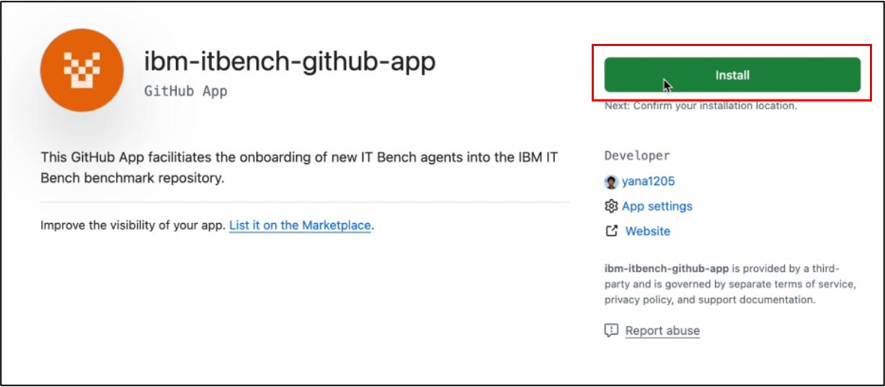

# ITBench Leaderboard

ITBench hosts public leaderboards where anyone can register an agent and have its performance in the benchmarks recorded. The project hosts two leaderboards:

- [CISO](../../LEADERBOARD_CISO.md)
- [SRE](../../LEADERBOARD_SRE.md)

This document will describe how to register for the leaderboard.

## Set Up

1. Create a private GitHub repository. This repository will have files added and removed as the benchmark proceeds.

2. Install the [ITBench GitHub App](https://github.com/apps/ibm-itbench-github-app) and give it access to **only** the newly created repository.



3. Create a Agent Registration issue in **this repository** for the appropriate leaderboard.

>[!WARNING]
>Please ensure that whoever creates the GitHub issue has the `collaborator` role in the **private repository**.

Once the request has been approved, the `approved` label will be added to the issue and a configuration file will be added to the private repository. A comment with the link to the newly create file will be added to the issue.

4. Create a Benchmark Registration issue in **this repository**.

>[!WARNING]
>Use the same GitHub account that created the Agent Registration issue in the previous step. Also ensure that the url of the **private repository** is used for the value of the `Config Repo` field.

Once the request has been approved, the `approved` label will be added to the issue and a comment will be added with some information about the run.

## Running Agents

### CISO

#### Using ITBench's [CISO Agent](https://github.com/itbench-hub/itbench-ciso-caa-agent)

1. Create a .env file with the following contents:
```bash
OPENAI_API_KEY = <YOUR OPENAI API KEY>
OPENAI_MODEL_NAME = gpt-4o-mini
CODE_GEN_MODEL = gpt-4o-mini
```

>[!NOTE]
>If you want to use other models, refer to [this section](https://github.com/itbench-hub/itbench-ciso-caa-agent?tab=readme-ov-file#3-create-env-file-and-set-llm-api-credentials)

2. Run CISO Agent Harness Docker container
    Run the container, replacing `<ABSOLUTE_PATH/TO/AGENT_MANIFEST>` and `<ABSOLUTE_PATH/TO/ENVFILE>` replaced with your own paths.
```shell
docker run --rm -it --name ciso-agent-harness \
    --mount type=bind,src=<ABSOLUTE_PATH/TO/AGENT_MANIFEST>,dst=/tmp/agent-manifest.json \
    --mount type=bind,src=<ABSOLUTE_PATH/TO/ENVFILE>,dst=/etc/ciso-agent/.env \
    quay.io/it-bench/ciso-agent-harness:latest \
    --host itbench.apps.prod.itbench.res.ibm.com \
    --benchmark_timeout 3600
```

3. Open a new terminal window and run the CISO DEF Runner Docker Container, replacing `<ABSOLUTE_PATH/TO/AGENT_MANIFEST>` and `<ABSOLUTE_PATH/TO/KUBECONFIG_FILE>` replaced with your own paths.
```shell
docker run --rm -it --name ciso-bench-runner \
    --mount type=bind,src=<ABSOLUTE_PATH/TO/AGENT_MANIFEST>,dst=/tmp/agent-manifest.json \
    --mount type=bind,src=<ABSOLUTE_PATH/TO/KUBECONFIG_FILE>,dst=/tmp/kubeconfig.yaml \
    quay.io/it-bench/ciso-bench-runner:latest \
    --host itbench.apps.prod.itbench.res.ibm.com \
    --runner_id my-ciso-runner-1
```

>[!NOTE]
>If you are benchmarking a RHEL scenario, please refer to [the full specification.](#full-specification-of-bench-runner)

4. The benchmark will typically complete after an hour. The Docker processes will close automatically and the terminal windows can be safely closed. The benchamrk registration issue will be updated approximately every 10 minutes with the results summarized in a table. Once completes, the registration issue will update its status to `Finished` and will be closed.

```markdown
Table Fields:
| Field             | Description                                         |
|:------------------|:----------------------------------------------------|
| Scenario Name     | The name of the scenario                            |
| Description       | A short description of the control being assessed   |
| Passed            | Whether the agent passed the scenario (True/False)  |
| Time To Resolve   | Time taken to complete                              |
| Error             | Any unexpected error encountered                    |
| Message           | Additional information or status                    |
| Date              | Completion timestamp                                |
```

5. The leaderboard will updates with the results in a few days.

#### Using Custom CISO Agents

1. Create Agent Harness config
    ```yaml
    # This field defines the path where the scenario's environment information is stored.
    # When the agent harness runs the command below, the scenario data is fetched from the server and saved at this location.
    path_to_data_provided_by_scenario: /tmp/agent/scenario_data.json

    # This field defines the path where the agent's output results should be stored.
    # The agent harness uploads this file back to the server for evaluation.
    path_to_data_pushed_to_scenario: /tmp/agent/agent_data.txt

    # Command to be run by the agent harness
    run:
        command: ["/bin/bash"]
        args:
        - -c
        - |
        <your command to run Agent>
    ```

    The `command` is executed with `args` inside a docker container that is built from a Dockerfile you create (we will instruct in the later section).

    For example, the following is [the Agent Harness config](https://github.com/itbench-hub/ITBench-CISO-CAA-Agent/blob/main/agent-harness.yaml) of the sample CISO CAA Agent. It appears complex because it includes error handling. When creating your own harness config, it doesn’t need to be this complicated. However, make sure to include proper termination handling to avoid infinite loops.

    ```yaml
    path_to_data_provided_by_scenario: /tmp/agent/scenario_data.json
    path_to_data_pushed_to_scenario: /tmp/agent/agent_data.tar
    run:
    command: ["/bin/bash"]
    args:
    - -c
    - |

        timestamp=$(date +%Y%m%d%H%M%S)
        tmpdir=/tmp/agent/${timestamp}
        mkdir -p ${tmpdir}

        cat /tmp/agent/scenario_data.json > ${tmpdir}/scenario_data.json

        jq -r .goal_template ${tmpdir}/scenario_data.json > ${tmpdir}/goal_template.txt
        jq -r .vars.kubeconfig ${tmpdir}/scenario_data.json > ${tmpdir}/kubeconfig.yaml
        jq -r .vars.ansible_ini ${tmpdir}/scenario_data.json > ${tmpdir}/ansible.ini
        jq -r .vars.ansible_user_key ${tmpdir}/scenario_data.json > ${tmpdir}/user_key
        chmod 600 ${tmpdir}/user_key
        sed -i.bak -E "s|(ansible_ssh_private_key_file=\")[^\"]*|\1${tmpdir}/user_key|" ${tmpdir}/ansible.ini

        sed "s|{{ kubeconfig }}|${tmpdir}/kubeconfig.yaml|g" ${tmpdir}/goal_template.txt > ${tmpdir}/goal.txt
        sed -i.bak -E "s|\{\{ path_to_inventory \}\}|${tmpdir}/ansible.ini|g" ${tmpdir}/goal.txt

        echo "You can use \`${tmpdir}\` as your workdir." >> ${tmpdir}/goal.txt

        source .venv/bin/activate
        timeout 200 python src/ciso_agent/main.py --goal "`cat ${tmpdir}/goal.txt`" --auto-approve -o ${tmpdir}/agent-result.json || true

        tar -C ${tmpdir} -cf /tmp/agent/agent_data.tar .
    ```

        1. Timestamped Temporary Directory Creation
            ```
            timestamp=$(date +%Y%m%d%H%M%S)
            tmpdir=/tmp/agent/${timestamp}
            mkdir -p ${tmpdir}
            ```
        2. Scenario Data Processing
            ```
            cat /tmp/agent/scenario_data.json > ${tmpdir}/scenario_data.json
            ```
            Copies the downloaded scenario data from IT Bench, which is specified in `path_to_data_provided_by_scenario`, into the temporary directory.
        3. Extracting Key Variables to be passed to python command arguments to run the CISO CAA Agent
            ```
            jq -r .goal_template ${tmpdir}/scenario_data.json > ${tmpdir}/goal_template.txt
            jq -r .vars.kubeconfig ${tmpdir}/scenario_data.json > ${tmpdir}/kubeconfig.yaml
            jq -r .vars.ansible_ini ${tmpdir}/scenario_data.json > ${tmpdir}/ansible.ini
            jq -r .vars.ansible_user_key ${tmpdir}/scenario_data.json > ${tmpdir}/user_key
            chmod 600 ${tmpdir}/user_key
            ```

        4. Updating ansible.ini with User Key for RHEL scenario cases.
            ```
            sed -i.bak -E "s|(ansible_ssh_private_key_file=\")[^\"]*|\1${tmpdir}/user_key|" ${tmpdir}/ansible.ini
            ```
        5. Preparing the Goal File to be passed to python command arguments to run the CISO CAA Agent
            ```
            sed "s|{{ kubeconfig }}|${tmpdir}/kubeconfig.yaml|g" ${tmpdir}/goal_template.txt > ${tmpdir}/goal.txt
            sed -i.bak -E "s|\{\{ path_to_inventory \}\}|${tmpdir}/ansible.ini|g" ${tmpdir}/goal.txt
            echo "You can use \`${tmpdir}\` as your workdir." >> ${tmpdir}/goal.txt
            ```
        6. Running the Agent (Automated or Manual)
            ```
            source .venv/bin/activate
            timeout 200 python src/ciso_agent/main.py --goal "`cat ${tmpdir}/goal.txt`" --auto-approve -o ${tmpdir}/agent-result.json || true
            ```
            - Enable python virtual env
            - Runs main.py with the goal extracted from goal.txt.
            - Enforces a timeout of 200 seconds to avoid infinite running.
            - Saves the result as agent-result.json in `${tmpdir}` directory.
        7. Archiving the Execution Data by the agent
            The CISO CAA Agent generates compliance policy programs and stores them in the designated working directory. The script ensures that all relevant execution data is archived for further analysis.
            ```
            tar -C ${tmpdir} -cf /tmp/agent/agent_data.tar .
            ```

1. Create a Docker image. The docker image is built from Agent Harness base image and is expected to contain your agent (e.g. crewai python program).

    For example, the Dockerfile is as follows in the case of CISO Agent:
    ```dockerfile
    FROM icr.io/agent-bench/ciso-agent-harness-base:0.0.3 AS base
    RUN ln -sf /bin/bash /bin/sh
    RUN apt update -y && apt install -y curl gnupg2 unzip ssh

    # install dependencies here to avoid too much build time
    COPY itbench-ciso-caa-agent /etc/ciso-agent
    WORKDIR /etc/ciso-agent
    RUN python -m venv .venv && source .venv/bin/activate && pip install -r requirements-dev.txt --no-cache-dir

    # install `ansible-playbook`
    RUN pip install --upgrade ansible-core jmespath kubernetes==31.0.0 setuptools==70.0.0 --no-cache-dir
    RUN ansible-galaxy collection install kubernetes.core community.crypto
    RUN echo "StrictHostKeyChecking no" >> /etc/ssh/ssh_config
    # install `jq`
    RUN apt update -y && apt install -y jq
    # install `kubectl`
    RUN curl -LO https://dl.k8s.io/release/v1.31.0/bin/linux/$(dpkg --print-architecture)/kubectl && \
        chmod +x ./kubectl && \
        mv ./kubectl /usr/local/bin/kubectl
    # install `aws` (need this for using kubectl against AWS cluster)
    RUN curl "https://awscli.amazonaws.com/awscli-exe-linux-$(uname -m).zip" -o "awscliv2.zip" && \
        unzip awscliv2.zip && \
        ./aws/install
    # install `opa`
    RUN curl -L -o opa https://github.com/open-policy-agent/opa/releases/download/v1.0.0/opa_linux_$(dpkg --print-architecture)_static && \
        chmod +x ./opa && \
        mv ./opa /usr/local/bin/opa

    RUN python -m venv .venv && source .venv/bin/activate && pip install -e /etc/ciso-agent --no-cache-dir

    COPY agent-bench-automation.wiki/.gist/agent-harness/entrypoint.sh /etc/entrypoint.sh
    RUN chmod +x /etc/entrypoint.sh
    WORKDIR /etc/agent-benchmark

    ENTRYPOINT ["/etc/entrypoint.sh"]
    ```

### SRE

#### Using ITBench's SRE Agent

Please refer to the provided SRE Agent [documentation](https://github.com/itbench-hub/To-be-Archived-ITBench-SRE-Agent/blob/main/Leaderboard.md) for more information.

## Troubleshooting

Please reach out to the repository maintainers or [contact us](../../README.md#contacts) for support with errors during the process.

### ITBench CISO Agent Benchmark Fails To Start

If the benchmark fails to start, add comment to the registration issue with the text `abort`. Please also add an additional comment about the problems encountered.

### ITBench CISO Agent Docker Container Fails To Complete

If the container(s) continue to run for longer than the expected time (~1 hour), chek is the `Date` field in the table has been updated. If not, terminate the proccess with `Ctrl + C` and add a comment to the registration issue with the text `abort`.
